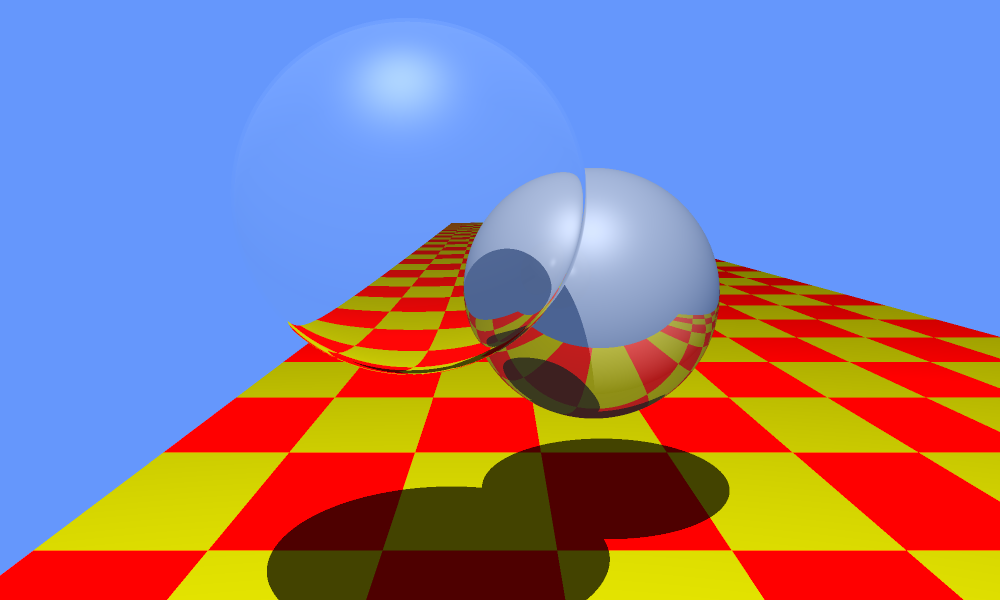
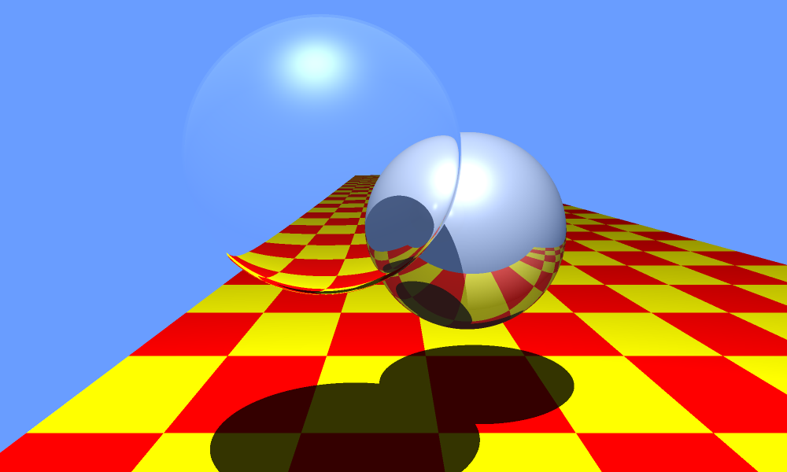
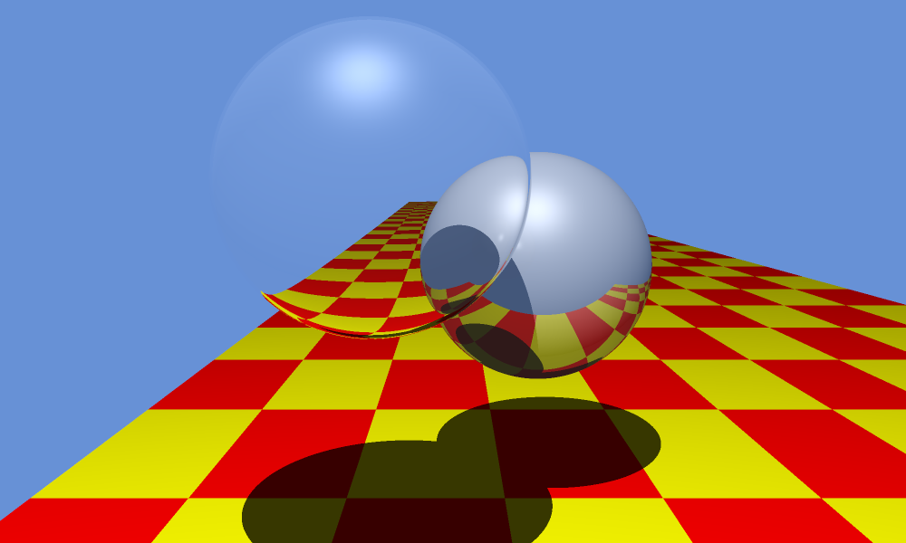

# CSCI-711
Global Illumination Ray Tracer in Rust

## Installation
Cargo and Rust: https://doc.rust-lang.org/cargo/getting-started/installation.html

Clone this repo into any directory

## Running
`cd raytracer` \
`cargo run`

An image will be outputted as `render.png` which you can view.

## Customization
Various run-time parameters can be changed from `main.rs`.

In the `main` function in `main.rs`, you can change the illumination model. By default, `IlluminationType::PhongBlinn` is used. Others available are `IlluminationType::Phong` and `IlluminationType::AshikhminShirley`. If you wish to change the specific parameters of these models, the `render` function in `camera.rs` contains a match statement creating each model.

```rust
let mut ill_model: Box<dyn IlluminationModel> = match illumination_type {
            IlluminationType::Phong => Box::new(Phong::new(0.2, 0.6, 0.2, 32.0)),
            IlluminationType::PhongBlinn => Box::new(PhongBlinn::new(0.2, 0.6, 0.2, 32.0)),
            IlluminationType::AshikhminShirley => Box::new(AshikhminShirley::new(100.0, 100.0)),
    };
```

Additionally, in `main`, the scene can be changed to the user's desire. There are a few functions such as `create_spheres()` and `create_floor()` which create the geometry used in the scene. These can be modified to change the material properties of an object such as their material type and material properties (reflection, trasmission, etc.). This is where you can add more lights if wanted as well.

By default, the floor is made up of two triangle primitives with a procedural material. This material has a function to decide the diffuse and specular colors that are used which is what creates the checkerboard pattern. Other available materials are flat materials -- which the spheres use -- and texture materials. Texture materials allow the use of textures to be used.

Lastly, the `create_camera()` function in `main.rs` is where the user can change the desired tone map used. Available to use are `ToneMapType::AdaptiveLog`, `ToneMapType::Reinhard`, and `ToneMapType::Ward`.

## Showcase
Adaptive-Logarithm tone mapping with L<sub>dmax</sub> = 0.9 and b = 0.95 (default setting).


Ward tone mapping with L<sub>dmax</sub> = 1.0.


Reinhard tone mapping with L<sub>dmax</sub> = 3.0.


